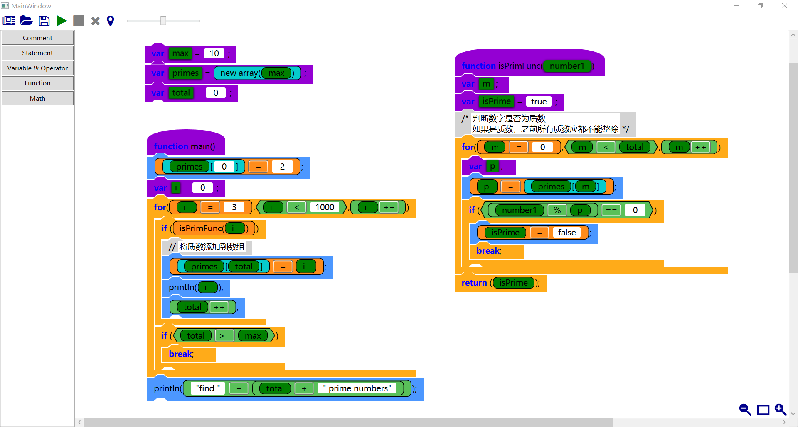
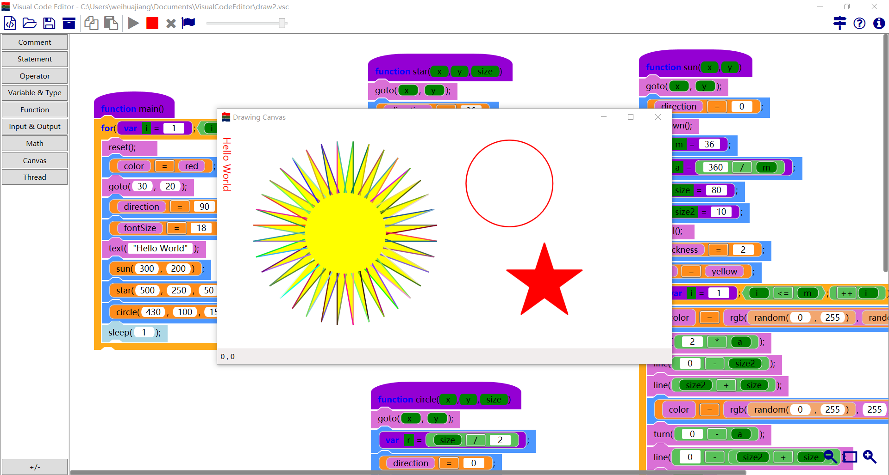
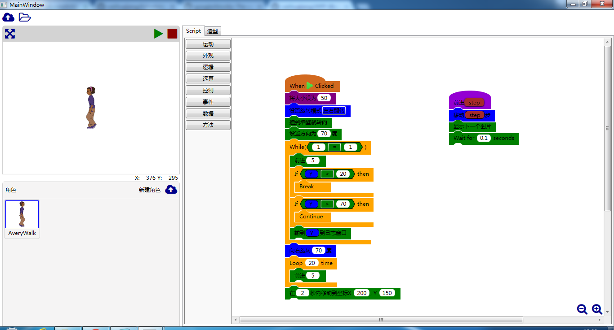

# WPF-Blocky

This is a visual programming editor like google blocky and scratch, but implemented by WPF and dotnet. Compared with existing tools, the visual script is more like real code, and it has more programming feature. With this tool, you can simply enable your application with a visual code editor and run your visual code. 

In the demo, we write a visual code editor, and scratch like editor. If you use it in other application, please tell us.

## Features

Now following feature was achieved

 - function with parameter and return value
 - recursive function
 - variable and variable scope (local variable)
 - operator, including +, -, *, /, %, &, |, ^, >>, <<, ++, --, &&, ||, !, +=, -=,*=,/=, &=, |=, ^=, >>=, <<=
 - if else, for, while, do while statement
 - loop flow control, including break, continue and return
 - try catch finally, exception handling
 - array
 - support string operation
 - support stack, queue, dictionary, list and binary tree
 - support sound synthesis
 - support translation
 - support drawing canvas liking python turtle

Besides the programming feature, this tool has following feature

 - execution step highlight
 - error position highlight
 - script serialization and deserialization
 
## Use Script Editor in your application

- Write your own Class instance
- Add GraphicScriptEditor into your window
- Set the new toolbar for GraphicScriptEditor
- Register color for each expression and statement
- Use Serialization.Load and Serialization.Save method to load your script from and save your script to file or stream

## Customize the look of your own expression and statement

To write your own expression and statement, you have inherit the Expression or Statement class, re-write Descriptor or BlockDescriptor to customize the look of your class.

The Descriptor for Expression
- TextItemDescriptor - text showed (IsKeyword property used to highlight the key word) 
- ExpressionDescriptor - text box for user input or drag a expression here
- ParameterDescriptor - parameter of function, user can drag this variable to other location
- VariableDeclarationDescription - variable declaration, user can drag this variable to other location
- StringInputDesciptor - text box for user input a single line of text
- MultiLineStringInputDesciptor - text box for user input multiple line of text
- SelectionItemDescriptor - combo box to show multiple variable for user selection
- ImageItemDescriptor - show image in expression

Some statement has only one line, the display of statement is the same as expression, so you use Descriptor only for Statement. The definition of Descriptor is the same as expression, write nothing in BlockDescriptor.

For some complex statement, like if-else, while statement, these statements have several BlockStatement and several Expression, you have to customize the BlockDescriptor.
- TextBlockStatementDescritor - text showed in statement line
- ExpressionStatementDescription - show an expression in statement
- BlockStatementDescriptor - BlockStatement position

For exsample, the if-else statement contains following BlockDescriptor,

 1. if - TextItemDescriptor for if and ExpressionDescriptor for Test
 2. BlockStatementDescriptor for Consequent BlockStatement
 3. else - TextItemDescriptor for else
 4. BlockStatementDescriptor for Alternate BlockStatement

## Execution of Expression and Statement

Override ExecuteImpl function, to write execution of your expression and statement. To execute other expression and statement, just call the Execute function. ExecutionEnvironment stores all the value of variable, you can register your variable in environment, before registration, you have to make sue the level of your ExecutionEnvironment, and should your use a new ExecutionEnvironment.

## Level of ExecutionEnvironment

Level of ExecutionEnvironment
- 1st Level - Base ExecutionEnvironment to store all the global variable and function
- 2bd Level - Class environment, store the static variable for each class
- 3rd Level - Instance environment, store all the non static variable of each instance of class
- 4th Level - function environment, store the variable of local variable of function
- 5th or more - store local variable of each block statement

## Completion of expression and statement

There are five completion type, Value, Exception, Break, Continue and Return. The loop statement will handle the break, continue completion, function statement will handle the return completion, try-catch statement will handle exception.

If your execution function, you must return the right completion type, return exception completion when exception happens, otherwise the execution of script will go wrong.

## Future Plan

- support EV3 control
- support file handling
- support switch statement
- static key word for variable and function.
- class and new expression for class
- use script as library or type
- performance improvement
 
 ## Screenshot

